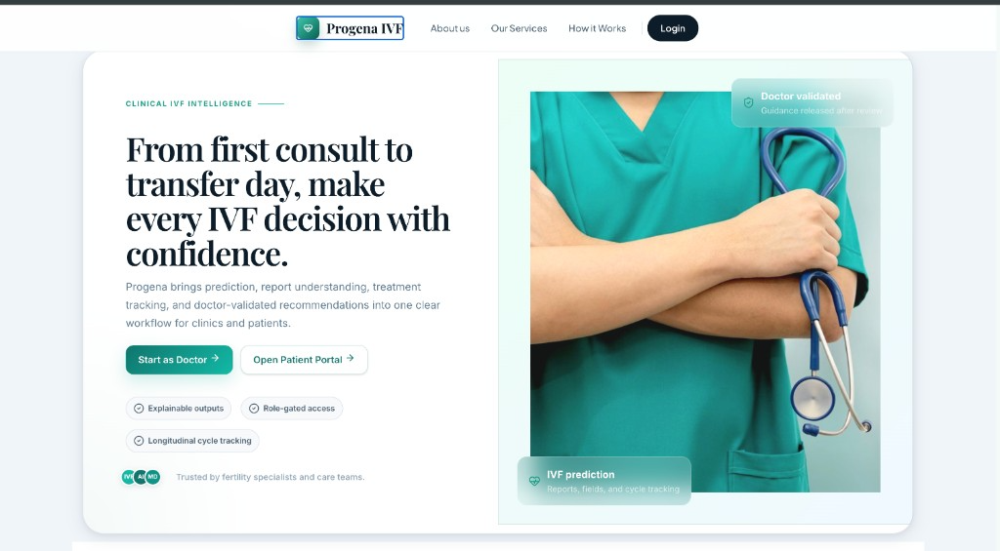

# 🧬 Progena — Explainable IVF Intelligence Platform

From prediction -> to explanation -> to decision.

## 🚀 Overview

Progena is an AI-powered IVF decision support platform designed to make complex fertility data understandable, explainable, and actionable.

Unlike traditional systems that output a single number:

`Success rate: 54%`

Progena answers:

- ❓ Why this prediction?
- ⚖️ What factors are helping or hurting?
- 📈 What can be improved?

It transforms IVF from a black-box prediction problem into a transparent decision-making experience for both doctors and patients.

## 🎯 Problem Statement

IVF (In Vitro Fertilization) decision-making is:

- Data-intensive
- Clinically complex
- Emotionally sensitive

### Existing Challenges

- ❌ Black-box AI predictions
- ❌ No interpretability
- ❌ No patient-friendly explanation
- ❌ Disconnected clinical data sources

## 💡 Solution

Progena integrates:

- 🧠 AI prediction models
- 🔍 Explainable AI insights
- 🧬 Embryo image analysis
- 🌐 Knowledge graph visualization
- 👩‍⚕️ Doctor-patient workflow system

👉 Result: A complete IVF intelligence platform, not just a prediction tool.

## ✨ Core Features

### 🧾 1. Multi-Modal Prediction System

Supports multiple input types:

- Structured clinical data
- 📄 PDF medical reports
- 🖼️ Embryo / lab images

Includes:

- Classification (pregnancy vs non-pregnancy)
- Confidence scoring
- Model-backed inference

### 🧠 2. Explainable AI Layer

Each prediction includes:

- 📌 Key contributing factors
- ✅ Positive influences
- ⚠️ Negative influences
- 💡 Actionable improvement suggestions

👉 Makes AI outputs interpretable and trustworthy.

### 🧬 3. Embryo Image Intelligence

- Image-based embryo classification
- Visual explainability using Grad-CAM
- Highlights regions influencing prediction

### 🌐 4. Knowledge Graph Visualization

Interactive IVF relationship mapping:

- Hormones ↔ Embryo quality
- Age ↔ Success probability
- Treatment ↔ Outcome

Built using:

- Cytoscape.js

👉 Converts complex medical relationships into intuitive visual graphs.

### 👩‍⚕️ 5. Role-Based Workflow System

**Doctor**

- View patient predictions
- Analyze risk factors
- Manage appointments

**Patient**

- View results
- Understand explanations
- Track notifications

### 🔔 6. Appointment & Notification System

- Appointment scheduling
- Patient-specific notifications
- Status tracking

## 🖥️ Demo Preview

Current dashboard preview:



👉 Recommended:

- Add GIF of prediction flow
- Add graph interaction preview

## 🏗️ System Architecture

```text
Frontend (React + Vite)
        ↓
FastAPI Backend (API + Logic)
        ↓
ML Models (Prediction + Explainability)
        ↓
Data Layer (JSON + Model Artifacts)
```

## 🧪 Tech Stack

### Frontend

- React (Vite)
- Cytoscape.js (Graph visualization)
- Framer Motion (Animations)
- Lucide Icons

### Backend

- FastAPI
- Uvicorn
- Python ML ecosystem

### AI / ML

- scikit-learn
- PyTorch
- Grad-CAM
- NLP utilities

### Data

- JSON-based storage
- Model artifacts (`model/`, `models/`)

## 📂 Project Structure

```text
├── nlp/         → APIs, prediction, explainability, auth
├── kg/          → Knowledge graph logic
├── frontend/    → React application
├── data/        → JSON storage (appointments, graph)
├── model/       → ML models
├── models/      → Additional artifacts
```

## ⚙️ Setup Instructions

### 🔹 Backend Setup (FastAPI)

```bash
python -m venv .venv
source .venv/bin/activate

pip install -r requiremnts.txt

uvicorn nlp.api:app --reload --port 8000
```

API Base URL:

- `http://localhost:8000`

Docs:

- `/docs` -> Swagger UI
- `/redoc` -> ReDoc

### 🔹 Frontend Setup (React + Vite)

```bash
cd frontend
npm install
npm run dev
```

Frontend runs at:

- `http://localhost:5173`

## 🔌 API Endpoints

| Endpoint | Description |
| --- | --- |
| `POST /predict` | Structured input prediction |
| `POST /predict/pdf` | PDF-based prediction |
| `POST /predict/image` | Image-based prediction |
| `POST /auth/login` | Demo login |
| `GET /appointments` | Fetch appointments |
| `POST /appointments` | Create appointment |
| `GET /notifications` | Get notifications |
| `POST /notifications/read` | Mark notification read |

## 🔄 Suggested Run Flow

1. Start backend
2. Start frontend
3. Open UI
4. Run prediction
5. Explore explanation + graph

## 🌍 Real-World Impact

Progena enables:

- 👩‍⚕️ Doctors -> Better clinical decisions
- 👩 Patients -> Clear understanding of IVF outcomes
- 🏥 Clinics -> Improved workflow efficiency

### Key Benefits

- Reduces uncertainty
- Builds trust in AI
- Improves treatment planning

## 🔮 Future Enhancements

- 🧬 3D IVF visualization (interactive embryo implantation)
- 🤖 AI agent for guided explanations
- ☁️ Cloud deployment
- 📱 Mobile support
- 📊 Advanced analytics dashboard

## 🏆 Why Progena Stands Out

- Combines AI + Explainability + Visualization
- Focuses on human-centered healthcare
- Bridges technical + clinical domains
- Designed as a complete product system